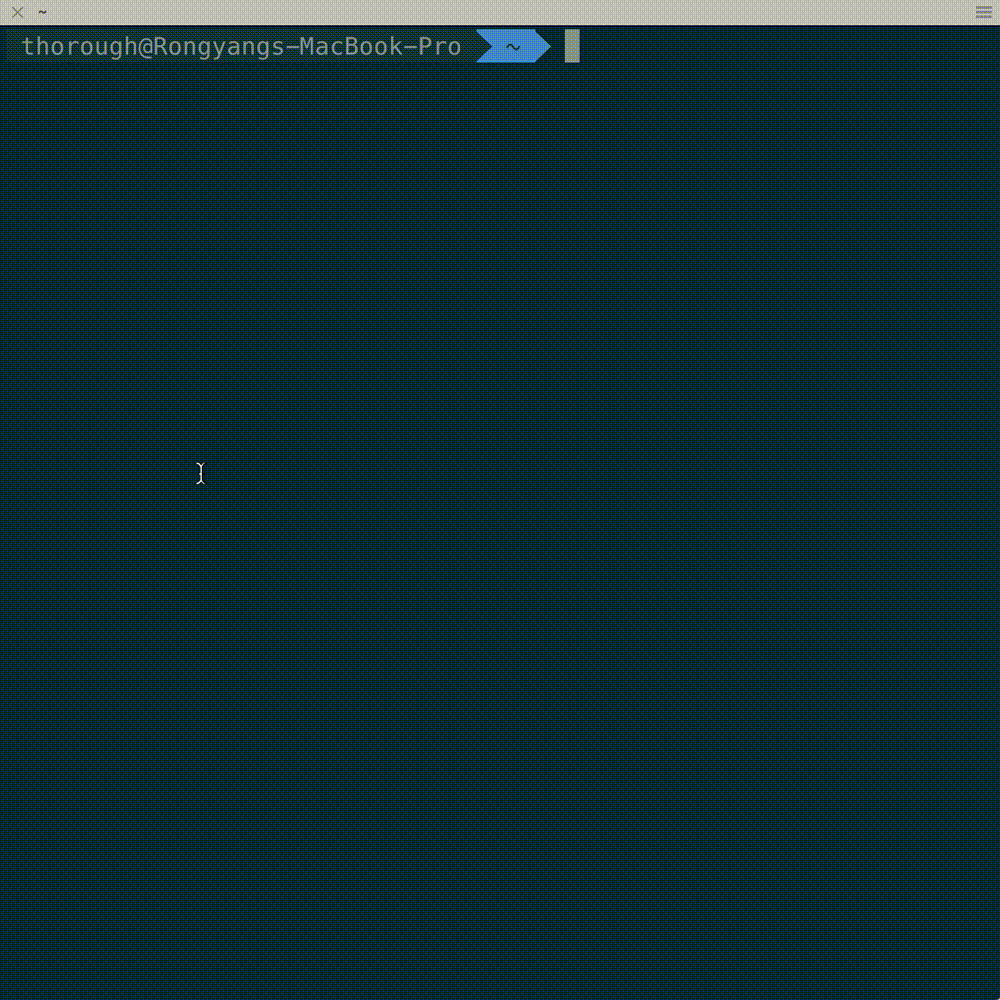

# todo

A lite command line tool for managing TODO list of your project.

## Introduction

When you develop a project or do something in command line environment, you may need a TODO list to mark things you need to do at future in the current folder. `todo` is a lite tool which can create, add and manage a TODO list file in a folder where you need.

You can use `todo init` to create a TODO list. A file named `.todo` will be created in the current folder. Then you can use `todo add` to add a TODO item to the TODO list. You can assign a priority to the item and the default priority is 0. And you can use `todo` cammand to show the list. When you finish a task in your TODO list, you can use `todo x` to mark the item as completed. The main features have been shown in the following demo.

## Demo



## Usage

The usage is very simple:

```shell
usage: todo [<command>] [<option>] [<args>]
command:
         NONE      Show TODO list
                   option:
                       NONE      Show TODO list sorted by priority (default)
                       -t        Show TODO list sorted by creation time
                       -p        Show TODO list sorted by priority
                       --help    Show todo help text
         init      Create a TODO list for current folder
         add       'TODO item content' [priority number from 0 to 3,
                   the default value is 0 which means the lowest priority]
                   Add a TODO item to TODO list
         x         Complete a TODO item
```

You can show this message using `todo --help`. 

## Installation

You can install `todo` at Linux or Mac OS system using `./install.sh` installation script:

```shell
./install.sh --prefix=$PATH_YOU_WANT_TO_INSTALLATION
```

`$PATH_YOU_WANT_TO_INSTALLATION` is the installation path. The default installation path is `/usr/local` when you execute the script without the `--prefix=` option. You can also use `./install.sh --help` to show installation help.

## Notes

If you have any questions, meet any problems or have any suggestions, please give me a feedback at Github or send an email to me. Thanks a lot.